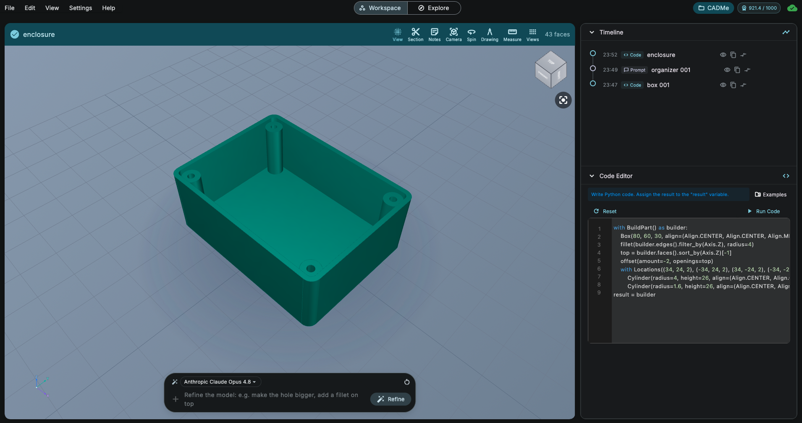

🇹🇷 [Türkçe](README.tr.md)

# ArgilCAD

**AI-powered parametric CAD**

Generate precise, editable parametric 3D models from natural language. Real CAD, AI speed.

[Website](https://argildesign.com/products/argilcad) · [Pricing](https://argildesign.com/products/argilcad/pricing.html) · [Support](https://argildesign.com/support.html)

---

## 📥 Download

> **First release coming soon!** ⭐ Star or 👁 Watch this repository to get notified when ArgilCAD is available for download.

All official releases will be published on the [**Releases**](../../releases) page of this repository.

| Platform | File |
|----------|------|
| macOS | `ArgilCAD-<version>.dmg` |
| Windows | `ArgilCAD-<version>-Setup.exe` |

Always download ArgilCAD from this repository or from [argildesign.com](https://argildesign.com/products/argilcad). Downloads from any other source are not official and may be unsafe.

## 💻 System Requirements

| | macOS | Windows |
|---|-------|---------|
| OS version | macOS 11 Big Sur or later | Windows 10 / 11 (64-bit) |
| Architecture | Apple Silicon & Intel | x64 |
| Other | Internet connection required for AI features | Internet connection required for AI features |

*Requirements may be refined before the first release.*

## 🔧 Installation

### macOS

1. Download the `.dmg` file from the [Releases](../../releases) page.
2. Open the DMG and drag **ArgilCAD** into your **Applications** folder.
3. Launch ArgilCAD from Applications. The app is signed and notarized by Apple, so it opens without warnings.

### Windows

1. Download the `-Setup.exe` installer from the [Releases](../../releases) page.
2. Run the installer and follow the steps.
3. Launch ArgilCAD from the Start menu.

> If Windows SmartScreen shows a notice for a newly published version, verify that the publisher is **Argil Design** before continuing.

## 🐛 Feedback & Support

- Found a bug? [Open an issue](../../issues/new/choose)
- Need help? Visit our [Support page](https://argildesign.com/support.html)

## 🔗 Links

- [Product page](https://argildesign.com/products/argilcad)
- [Pricing](https://argildesign.com/products/argilcad/pricing.html)
- [Support](https://argildesign.com/support.html)
- [Privacy Policy](https://argildesign.com/privacy.html)
- [Terms of Service](https://argildesign.com/terms.html)
- [Refund Policy](https://argildesign.com/refund.html)

## 📄 License

ArgilCAD is proprietary software by **Argil Design**. This repository hosts release binaries and documentation only; it does not contain source code. Use of ArgilCAD is subject to the [Terms of Service](https://argildesign.com/terms.html).
