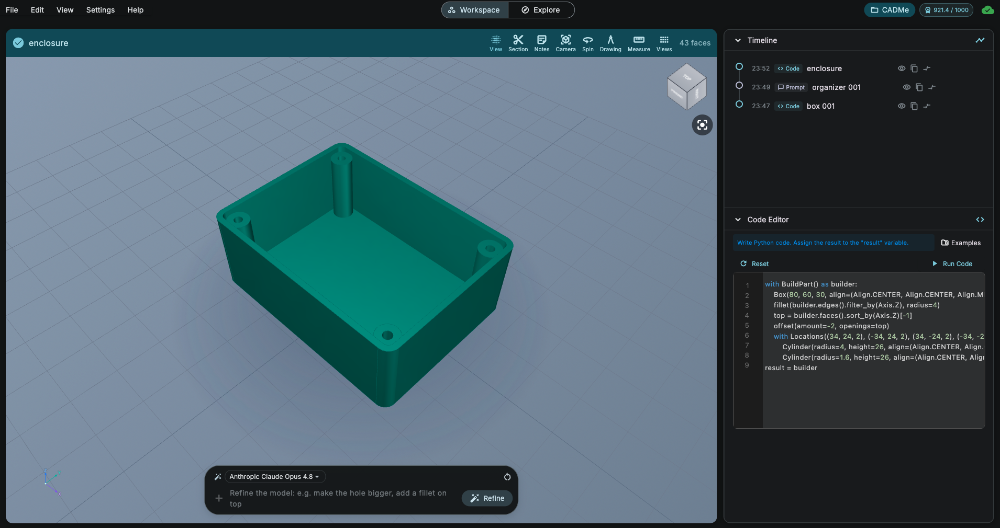

🇬🇧 [English](README.md)

# ArgilCAD

**Yapay zekâ destekli parametrik CAD**

Doğal dilden hassas, düzenlenebilir parametrik 3B modeller üretin. Gerçek CAD, yapay zekâ hızında.

[Web sitesi](https://argildesign.com/tr/products/argilcad) · [Fiyatlandırma](https://argildesign.com/tr/products/argilcad/pricing.html) · [Destek](https://argildesign.com/tr/support.html)

---

## 📥 İndirme

Tüm resmî sürümler bu deponun [**Releases**](../../releases) sayfasında yayınlanır. Aşağıdaki bağlantılar her zaman en güncel sürüme gider.

| Platform | Dosya | İndirme |
|----------|-------|---------|
| macOS (Apple Silicon) | `ArgilCAD-macos.dmg` | [En son sürüm](../../releases/latest/download/ArgilCAD-macos.dmg) |
| Windows (64-bit) | `ArgilCAD-windows-setup.exe` | [En son sürüm](../../releases/latest/download/ArgilCAD-windows-setup.exe) |

⭐ Yıldızlayın veya 👁 Watch ile takip edin — yeni sürümlerden haberdar olun.

ArgilCAD'i yalnızca bu depodan veya [argildesign.com](https://argildesign.com/tr/products/argilcad) adresinden indirin. Başka kaynaklardan yapılan indirmeler resmî değildir ve güvenli olmayabilir.

## 💻 Sistem Gereksinimleri

| | macOS | Windows |
|---|-------|---------|
| İşletim sistemi | macOS 11 Big Sur ve üzeri | Windows 10 / 11 (64-bit) |
| Mimari | **Yalnızca Apple Silicon** (M1, M2, M3, M4 …) | x64 |
| Diğer | Yapay zekâ özellikleri için internet bağlantısı gereklidir | Yapay zekâ özellikleri için internet bağlantısı gereklidir |

> ⚠️ **Intel işlemcili Mac'ler henüz desteklenmiyor.** ArgilCAD şu anda yalnızca
> Apple Silicon için yayınlanıyor. Intel bir Mac'te uygulama açılır, ancak
> dahili CAD motoru başlatılamaz ve model üretimi çalışmaz. Intel desteği
> ilerleyen bir sürüm için planlanıyor.
>
> Mac'inizin hangisi olduğundan emin değil misiniz? → **Apple menüsü → Bu Mac
> Hakkında**. *Çip* satırında "Apple M1/M2/M3/M4" yazıyorsa Apple Silicon
> kullanıyorsunuz. *İşlemci* satırında "Intel" yazıyorsa lütfen Intel
> sürümünü bekleyin.

## 🔧 Kurulum

### macOS (Apple Silicon)

1. Mac'inizde Apple Silicon çip bulunduğunu doğrulayın (**Apple menüsü → Bu Mac Hakkında → Çip**). Intel Mac'ler henüz desteklenmiyor.
2. [Releases](../../releases) sayfasından `ArgilCAD-macos.dmg` dosyasını indirin.
3. DMG dosyasını açın ve **ArgilCAD**'i **Applications** (Uygulamalar) klasörüne sürükleyin.
4. ArgilCAD'i Uygulamalar'dan başlatın. Uygulama Apple tarafından imzalanmış ve notarize edilmiştir; uyarı vermeden açılır.

### Windows

1. [Releases](../../releases) sayfasından `ArgilCAD-windows-setup.exe` yükleyicisini indirin.
2. Yükleyiciyi çalıştırın ve adımları izleyin.
3. ArgilCAD'i Başlat menüsünden başlatın.

> Yeni yayınlanan bir sürüm için Windows SmartScreen bir bildirim gösterirse, devam etmeden önce yayıncının **Argil Design** olduğunu doğrulayın.

## 🐛 Geri Bildirim ve Destek

- Bir hata mı buldunuz? [Issue açın](../../issues/new/choose)
- Yardım mı gerekiyor? [Destek sayfamızı](https://argildesign.com/tr/support.html) ziyaret edin

## 🔗 Bağlantılar

- [Ürün sayfası](https://argildesign.com/tr/products/argilcad)
- [Fiyatlandırma](https://argildesign.com/tr/products/argilcad/pricing.html)
- [Destek](https://argildesign.com/tr/support.html)
- [Gizlilik Politikası](https://argildesign.com/tr/privacy.html)
- [Kullanım Şartları](https://argildesign.com/tr/terms.html)
- [İade Politikası](https://argildesign.com/tr/refund.html)

## 📄 Lisans

ArgilCAD, **Argil Design** tarafından geliştirilen tescilli (proprietary) bir yazılımdır. Bu depo yalnızca sürüm dosyalarını ve dokümantasyonu barındırır; kaynak kodu içermez. ArgilCAD'in kullanımı [Kullanım Şartları](https://argildesign.com/tr/terms.html)'na tabidir.
